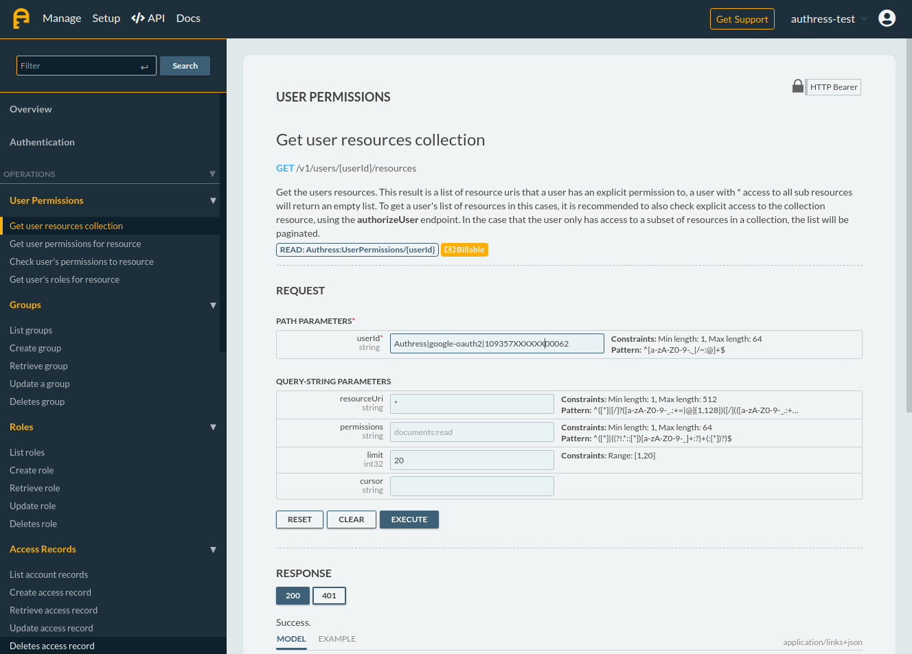

# OpenAPI Explorer
Web Component Custom Element for Open-API spec viewing, with automatic integration for React and Vue.

_(This project was forked from [RapiDoc](https://github.com/mrin9/RapiDoc), and provides a cleaner skimmed down version of the functionality which works out of the box!)_

<p align="center">
    
    <!---->
    <!---->
    <a href="https://badge.fury.io/js/openapi-explorer" alt="npm version">
        
    </a>
    <a href="https://www.webcomponents.org/element/openapi-explorer" alt="published on webcomponents.org">
        
    </a>
</p>


## Beautiful and responsive API explorer and console

<p>
  
</p>

## Check out the Demo
[OpenAPI Explorer Demo](https://authress.io/app/?utm_source=oae&utm_medium=github&utm_campaign=cross-link&utm_content=demo#get-/v1/users/-userId-/resources)

## Get started now
`npm i openapi-explorer`

### Quick start example
* `import 'openapi-explorer';`

```html
<openapi-explorer :id="apiExplorer" :spec-url="openapiSpecificationUrl">
  <div slot="overview">
    <h1>The API</h1>
  </div>
</openapi-explorer>
```

## Features
- OpenAPI 3.0 
- Works with any framework
- View resources, models, and directly make API calls
- Better Usability, 
  - Request fields are pre-populated with default data
  - Takes only one click to make an API call
- Branding and Personalization features makes it easy to follow any style guide
  - Fully customizeable theme
- Plenty of customization options 
  - Add external contents at the top and bottom of the document,  you may add images, link, text, forms etc
  - Allows disabling API calling feature
  - All properties are reactive
  - Style the element with standard css (change padding, position, border, margin )
- Responsive so it works on mobile
- Lightweight and fast


## Documentation
* [Property and variables documentation](./docs/documentation.md)
* [Examples (Vue, React, JS, and more)](./docs/examples.md)

## Troubleshooting integration issues
[Common issues](./docs/troubleshooting.md)


## Contribution
[Contributions Guide](./CONTRIBUTING.md)

```bash
# Clone / Download the project then
git clone

## Pull in dependencies (yarn does not work)
npm install

# build will generate dist/openapi-explorer.min.js
npm run build 

import 'openapi-explorer';
```
