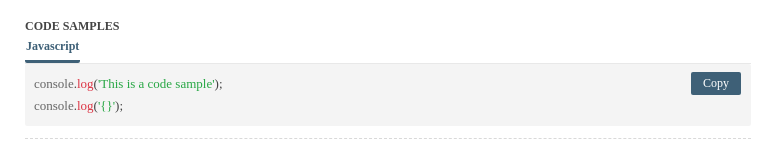

## Documentation

## Properties

### Setup (Required)
* `explorer-location` - current location of the document. Set to dynamically navigate to the location in the doc using the path.
* `spec-url` - OpenAPI specification document url
* `server-url` - Set the server url, when not specified will be by default the host of the `spec-url`.

#### Enable functionality
* `enable-console` - [true] Allow for disabling executing the API from the specification. Removes the `execute button` when disabled.
* `fill-defaults` - [true] Fills the request data with the default data.

### Hide/Show Sections
* `show-authentication` - Show the authentication section
* `show-server-selection` - Show server selection section

### Custom configuration
* `use-path-in-nav-bar` - Show the `HTTP Method - Resource Path` instead of `Path or Method description`
* `nav-item-spacing` - Text spacing in the nav bar [`default`, `compact`, `relaxed`]

### Colors
Note: This properties will likely be deprecated in favor of global css variables being set, are still available

* `bg-color` - Set the background color [Expected Bootstrap value: `$light`]
* `primary-color` - Set the primary [Expected Bootstrap value: `$primary`]
* `secondary-color` - Set the secondary color used for accents [Expected Bootstrap value: `$primary`]
* `text-color` - Set the default text color [Expected Bootstrap value: `$grey`]

* `nav-bg-color` - Set the navigation background color [Expected Bootstrap value: `$dark`]
* `nav-hover-text-color` - Set th color of hover on navigation links [Expected Bootstrap value: `$light`]
* `nav-text-color` - Set th color of hover on navigation links [Expected Bootstrap value: `$grey`]

### Library API
* `async loadSpec(spec)` - Load a spec from an object rather than looking it up from a remote url.
* `setSecuritySchemeToken(securitySchemeId, token)` - Set a token for methods that require security for a particular security scheme id.
  * If the securityScheme id was `auth` and the `type` of that scheme was basic: `setSecuritySchemeToken('auth', 'user:password');`

### Events
* `@spec-loaded` - Event trigger after the specification is loaded. Can be used to modify the spec including updating values.

```html
<openapi-explorer @spec-loaded="onSpecLoaded"> </openapi-explorer>
```

For example populate the user's id into default property to be automatically used:
```js
onSpecLoaded(data) {
  data.detail.tags.forEach(tag => {
    tag.paths.filter(path => path.parameters).forEach(path => {
      const userParameter = path.parameters.find(p => p.name === 'userId');
      if (userParameter) {
        userParameter.schema.default = this.$store.state.profile?.userId;
      }
    });
  });
}
```

* `@request` - Event trigger when console execute is used. Can modify the request url and body before sent to the server
```html
<openapi-explorer @request="requestInterceptor"> </openapi-explorer>
```

```js
requestInterceptor(event) {
  Object.assign(event.detail.request.options.headers, { Authorization: `Bearer ${userToken}` });
}
```

* `@response` - Event trigger to handle responses back from the console requests.
```html
<openapi-explorer @response="responseInterceptor"> </openapi-explorer>
```

```js
responseInterceptor(event) {
  if (event.detail.response?.status === 401) {
    this.enableSignupModal = true;
  }
}
```

### Slots
```html
<div slot="overview">
    <h1>Overview</h1>
    <div>Replaces the overview section</div>
</div>

<div slot="authentication">
    <h1>Authentication</h1>
    <div>Replaces the authentication section</div>
</div>

<div slot="servers">
    <h1>Servers</h1>
    <div>Replaces the servers section</div>
</div>

#### Custom Navigation section
<!-- Add custom nav sections to link to the custom section -->
<div slot="nav-section">Section 1</div>
<div slot="nav-section">Section 2</div>

<!-- Then render the custom section -->
<div slot="custom-section">
  <h1>A custom section rendered when selected.</h1>
</div>

#### Tag and operations slot configuration

<!-- Hide a tag from navigation -->
<div div="nav-tag--${tagName}"></div>

<!--
  Example: GET /v1/resources/{resourceUri}/users becomes => get-/v1/resources/-resourceUri-/users
  For the parser: https://github.com/Rhosys/openapi-explorer/blob/e43a90c23be4813d2d8381b59a95bc15573c2513/src/utils/common-utils.js#L13
-->
<div :name="${method}-${sanitizedPath}">
    <h1>Path Info</h1>
    <div>Additional method/path related information</div>
</div>

```

### SDK code samples
OpenAPI Explorer supports inline code samples using the `x-code-samples` OpenAPI vendor extension. Just add your code sample into the array and it will dynamically appear as an example in the doc.
```json
"get": {
  "x-code-samples": [{
    "lang": "Javascript",
    "label": "JS + Axios",
    "source": "console.log('This is a code sample')"
  }]
}
```
<p>
  
</p>

### Styling using CSS variables
In many cases these might have already been set by your css framework, if not, and you want to override the the defaults to match your theme. For more in-depth options check out [How to style your openapi-explorer UI](./docs/styling.md).
* CSS (default set to page fonts) - Add to your css
```css
openapi-explorer {
  --purple: #6f42c1;
  --pink: #e83e8c;
  --red: #dc3545;
  --orange: #fd7e14;
  --yellow: #ffc107;
  --green: #28a745;
  --white: #fff;
}
```