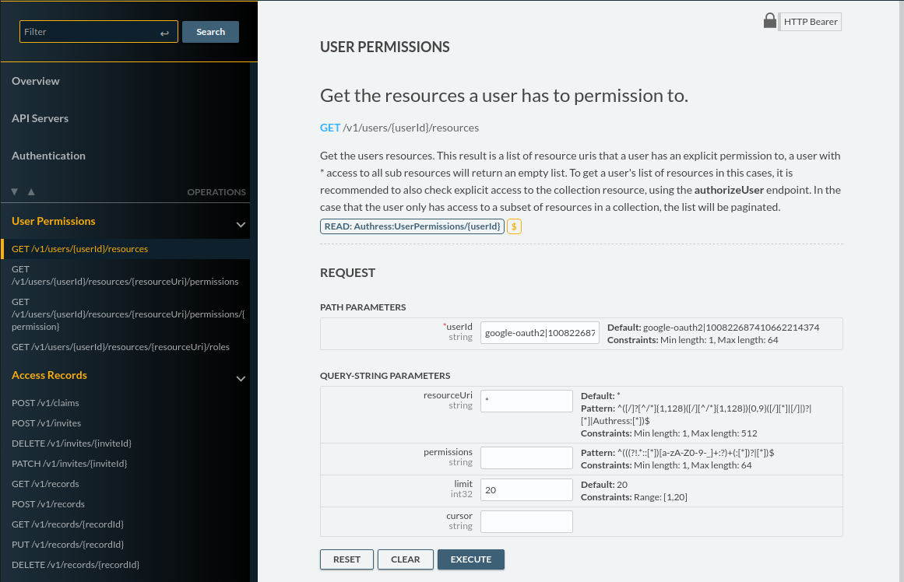

## Styling OpenAPI Explorer
When you insert `<openapi-explorer> element in an HTML, It is important to note that none of the existing style or css declarations will affect it as this uses style encapsulation via shadow DOM. This is important so that classes created in this component don't affect your app, but also has the hindrance of not allowing styling of the component directly. There are however some great and easy options to styling it.

### Setting the theme properties
By default some of the themeable properties can be set directly as html attributes. Check out [openapi-explorer attributes](./documentation.md) for details about those attributes.

### Overriding the CSS Variables
Variables used by the component can be directly overwritten and will be consumed in the component without any additional changes. For example to change one of the color variables, in the css section update the color:
```css
openapi-explorer {
  --purple: #6f42c1;
}
```

The available variables are:
Explorer location   | Variables
--------------------|--------------------
Fonts               | `--font-regular` `--font-mono`

### Directly amending classes
While openapi-explorer uses a shadow DOM, it is easy to inject in CSS overrides to the existing styles. After creating the DOM element for the `openapi-explorer` using javascript you can:

```js
// Get the openapi-explorer element
const apiExplorer = document.getElementsByTagName('openapi-explorer')[0];
const style = document.createElement('style');
// Hide the navbar and set the background to be white
style.innerHTML = `
.nav-bar.focused { display: none !important; }
:host {
  --input-bg: white;
}`
apiExplorer.shadowRoot.appendChild(style);

// Or if there are a lot of styles create a stylesheet and inject it in:
const linkElem = document.createElement('link');
linkElem.setAttribute('rel', 'stylesheet');
linkElem.setAttribute('href', 'style.css');
apiExplorer.shadowRoot.appendChild(linkElem);
```

### Using CSS ::Parts
CSS provides parts, these are special attributes, but that isn't really important. What's important is that you can directly target these in the component for styling. They support simple styling without complexity:

<p>
  
</p>

```html
<html>
  <style>
    /* <<< targets navigation bar part selector, it's called `section-navbar`. We can see from the image that there is a linear gradient applied to using the original nav background color, transitioned to black. */
    openapi-explorer::part(section-navbar) {
      background: linear-gradient(90deg, var(--nav-bg-color), black);
    }
  </style>

  <openapi-explorer spec-url="https://petstore.swagger.io/v2/swagger.json"></openapi-explorer>
</html>
```

There are many available `::part` selectors and many ways of styling based on parts. Here is a list of all the parts in the app, andy of them are styleable:

Explorer location   | CSS ::part selector
--------------------|--------------------
Sections            | `section-navbar` `section-header` `section-main-content` `section-logo` `section-overview` `section-auth` `section-auth-scopes` `section-servers` `section-tag` `section-operations-in-tag` `section-operation`
Navbar              | `navbar-scroll` `navbar-operations-header`
Labels              | `label-header-title` `label-overview-title` `label-selected-server` `label-tag-title` `label-operations-method` `label-operation-path`
Buttons             | `btn` `btn-fill` `btn-outline` `btn-search`
Checkboxes/ Toggles | `checkbox` `checkbox-auth-scope`
Anchors             | `anchor` `anchor-overview`
